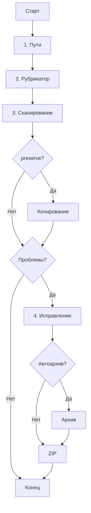

# Блок-схема алгоритма АРМ «Адаптация под DBI»

```mermaid
graph TD
    A[Старт] --> B[1. Пути]
    B --> C[2. Рубрикатор]
    C --> D[3. Сканирование]
    D --> E{preserve?}
    E -->|Да| F[Копирование]
    E -->|Нет| G{Проблемы?}
    F --> G
    G -->|Нет| Z[Конец]
    G -->|Да| H[4. Исправление]
    H --> I{Автоархив?}
    I -->|Да| J[Архив]
    I -->|Нет| K[ZIP]
    J --> K
    K --> Z
```