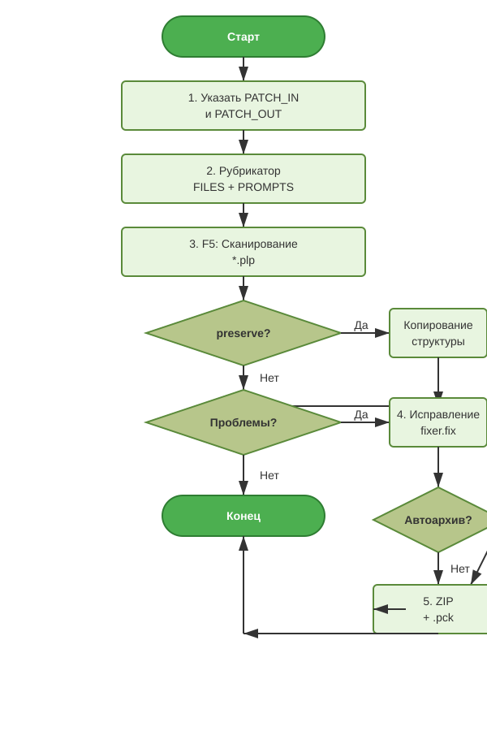

# Блок-схема алгоритма АРМ «Адаптация под DBI» (вертикальная)

## Описание этапов

| Этап | Клавиша | Описание |
|------|---------|----------|
| 1. Пути | — | Выбор `PATCH_IN`, автозаполнение `PATCH_OUT` |
| 2. Рубрикатор | — | Загрузка FILES + PROMPTS, выбор правил |
| 3. Сканирование | F5 | Рекурсивный обход `*.plp`, генерация отчёта |
| 4. Исправление | F6 | Применение `fixer.fix_directory`, лог |
| 5. Архивация | Авто/Кнопка | ZIP + .pck в `PATCH_OUT` |