# Блок-схема алгоритма АРМ «Адаптация под DBI»

```mermaid
%%{init: {"theme":"base","themeVariables":{"background":"#93C572","primaryColor":"#e8f5e0","primaryBorderColor":"#5a8a3a","lineColor":"#3d6b1f","fontSize":"12px"},"flowchart":{"nodeSpacing":12,"rankSpacing":20,"useMaxWidth":true}}}%%
graph LR
    Start(["Старт"]) --> P1["1. PATCH_IN<br/>→ PATCH_OUT"]
    P1 --> P3{"Каталоги<br/>указаны?"}
    P3 -->|"Нет"| P1
    P3 -->|"Да"| P2["Настройки:<br/>*.plp, логи,<br/>preserve_structure"]
    P2 --> R1["2. Рубрикатор<br/>FILES + PROMPTS<br/>Treeview"]
    R1 --> R3{"Правило<br/>выбрано?"}
    R3 -->|"Нет"| R1
    R3 -->|"Да"| S1["3. F5: Сканирование<br/>*.plp → scan_report"]
    S1 --> F1{"preserve<br/>_structure?"}
    F1 -->|"Да"| F2["Копирование<br/>структуры"]
    F1 -->|"Нет"| F3{"Проблемы<br/>найдены?"}
    F2 --> F3
    F3 -->|"Нет"| End(["Конец"])
    F3 -->|"Да"| F4["4. F6: fixer.fix_directory<br/>→ fix_log"]
    F4 --> F5{"Авто<br/>архив?"}
    F5 -->|"Да"| F6["_run_archive"]
    F5 -->|"Нет"| A1["5. ZIP + .pck<br/>→ PATCH_OUT"]
    F6 --> A1
    A1 --> End
```

Исходный код Mermaid-диаграммы

## Описание этапов

| Этап | Клавиша | Описание |
|------|---------|----------|
| 1. Пути + Настройки | — | Выбор `PATCH_IN`, автозаполнение `PATCH_OUT`; паттерн файлов `**/*.plp`, уровень логов, `preserve_structure`, `only_modified`, `scan_recursive` |
| 2. Правила рубрикатора | — | Загрузка `1.RUBRICATOR_FILES.md` и `4.RUBRICATOR_PROMPTS.json`, выбор правил в Treeview |
| 3. Сканирование кода | F5 | Рекурсивный обход `*.plp` через `PLPlusScanner`, генерация `scan_report_*.md` |
| 4. Исправление кода | F6 | Копирование структуры (если `preserve_structure`), применение `fixer.fix_directory`, лог `fix_log_*.md`, автоархивация |
| 5. Архивация | Авто/Кнопка | Создание ZIP-архива, копирование `.pck` файла, сохранение в `PATCH_OUT` |

> **Примечание:** Если проблем не найдено (`F3 → Нет`), процесс завершается без исправления и архивации. Архивация доступна как автоматически (через `_run_archive` при `preserve_structure`), так и вручную кнопкой.
